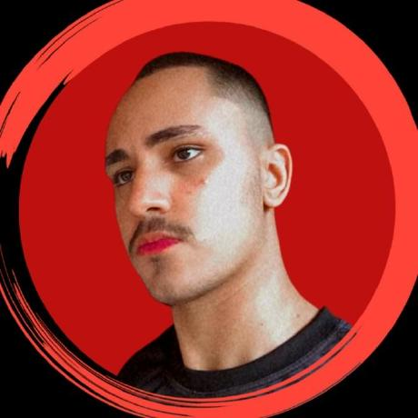

# Modelagem de Dados de uma Rede Farmacêutica

Este projeto representa o esforço colaborativo de estudantes da Universidade Federal de Mato Grosso, concluído em abril de 2024, como parte dos requisitos da disciplina de Laboratório de Banco de Dados. O objetivo era desenvolver um sistema de banco de dados robusto para uma rede farmacêutica com múltiplas filiais espalhadas pelo Brasil, focando na melhoria da eficiência operacional e no gerenciamento de informações.

## Ideia do Projeto

O projeto visa a criação de um banco de dados detalhado que suporte as operações cotidianas de uma rede farmacêutica expansiva, incluindo gestão de estoques, controle de vendas, administração de filiais, e mais. A modelagem considera entidades como filiais, funcionários, produtos, clientes, e fornecedores, facilitando a tomada de decisões informadas e aprimorando a qualidade dos serviços oferecidos.

## Visão Geral

O sistema de banco de dados foi projetado para oferecer uma estrutura organizacional clara, permitindo fácil acesso e manipulação de dados críticos para a operação da rede farmacêutica. Ele abrange desde a modelagem conceitual até a implementação física do banco de dados, incluindo a criação de tabelas SQL, triggers, procedures, e muito mais.

## Tecnologias Utilizadas

O desenvolvimento do projeto foi baseado no seguinte stack tecnológico:

- **SGBD (Sistema de Gerenciamento de Banco de Dados)**: PostgreSQL, devido à sua robustez e suporte extensivo a funcionalidades avançadas.
- **Ferramentas de Modelagem**: Utilizamos ferramentas como o MIRO para a criação do Diagrama Entidade-Relacionamento (DER), facilitando a visualização e o planejamento do banco de dados.
- **Linguagens de Programação**: SQL para a manipulação de dados e PL/pgSQL para a implementação de triggers e procedimentos armazenados, proporcionando automatização e integridade dos dados.

## Contato
<strong> Membros Desenvolvedores do Projeto: </strong> Somos ambos estudantes de Ciência da Computação na Universidade Federal de Mato Grosso - Turma de 2022.

| Membro | Foto | Email | LinkedIn |
| --- | --- | --- | --- |
| Anthony Ricardo Rodrigues Rezende |  | anthony_rodriguespereira@outlook.com | [LinkedIn do Anthony](https://www.linkedin.com/in/anthony-ricardo-rodrigues-rezende-486917227/) |
| Alan Bruno Moraes Costa |  | alanbrunomoraescosta18@hotmail.com | [LinkedIn do Alan](https://www.linkedin.com/in/alan-morais-4861322b0) |
| Vinicius Padilha Vieira |  | vinicius_padilhavieira@outlook.com | [LinkedIn do Vinicius](https://www.linkedin.com/in/vinicius-padilha-vieira-486917227/) |

##
